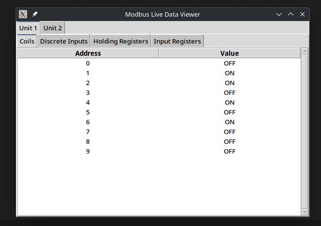
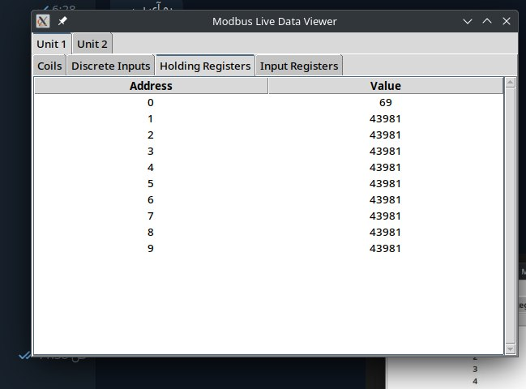

# Modbus Live Data Viewer

A Python-based tool for monitoring live data from Modbus TCP servers. It offers both a command-line interface and a graphical user interface (GUI) for viewing data such as coils, discrete inputs, holding registers, and input registers from multiple Modbus devices.


## Prerequisites

- **Python 3.6 or higher**.
- **pip** package manager.
- **Tkinter** library for GUI (installation varies based on your operating system).

## Installation

### 1. Clone the Repository

First, clone this repository to your local machine:

### 2. Set Up Python Virtual Environment

It's recommended to use a Python virtual environment to manage dependencies. This ensures that your project’s dependencies are isolated from other Python projects on your system.

```bash
python3 -m venv env
source env/bin/activate
```

*On Windows:*

```bash
python -m venv env
env\Scripts\activate
```

### 3. Install Python Dependencies

The project relies on several Python packages listed in `requirements.txt`. Install them using `pip`:

```bash
pip install -r requirements.txt
```

### 4. Install Tkinter

**Tkinter** is required for the GUI application (`scanner_gui.py`). Installation steps vary based on your Linux distribution.

#### **For Ubuntu/Debian-Based Systems**

```bash
sudo apt-get update
sudo apt-get install python3-tk
```

#### **For Fedora**

```bash
sudo dnf install python3-tkinter
```

#### **For CentOS/RHEL**

```bash
sudo yum install python3-tkinter
```

#### **For Arch Linux**

```bash
sudo pacman -S tk
```

*Note:* Tkinter usually comes pre-installed with Python. If you're using a different operating system or encounter issues, refer to the [official Tkinter documentation](https://docs.python.org/3/library/tkinter.html) for guidance.

## Usage

After completing the installation steps, you can run the scripts as follows:

### 1. Command-Line Interface

The `scanner.py` script allows you to view live data in the terminal in tabular form.

```bash
python scanner.py
```

### 2. Graphical User Interface

The `scanner_gui.py` script launches a GUI window where you can monitor data through interactive tabs.

```bash
python scanner_gui.py
```

## Configuration

Both scripts include configuration settings that specify the Modbus server's IP address, port, unit IDs, and the start addresses and quantities for each data type. You can customize these settings directly in the scripts by modifying the following sections:

```python
# Configuration
SERVER_HOST = "127.0.0.1"  # Replace with your Modbus server IP
SERVER_PORT = 502              # Replace with your Modbus server port if different
UNIT_IDS = [1, 2]              # List of unit IDs you want to query

# Define start addresses and quantities for each data type
start_addresses = {
    'coils': (0, 10),             # (start_address, quantity)
    'discrete_inputs': (0, 10),
    'holding_registers': (0, 10),
    'input_registers': (0, 10)
}
```

Adjust these parameters based on your Modbus server's configuration.

## Project Structure

```
modbus-live-data-viewer/
├── scanner.py
├── scanner_gui.py
├── requirements.txt
└── README.md
```

- **scanner.py**: Command-line tool for displaying Modbus data in the terminal using `tabulate`.
- **scanner_gui.py**: GUI application built with Tkinter for an organized, tabbed view of Modbus data.
- **requirements.txt**: Lists Python packages required by the project.
- **README.md**: Project documentation (this file).

## Requirements

The project dependencies are listed in `requirements.txt`. Here's the content:

```text
pyModbusTCP
tabulate
```

After setting up your virtual environment and activating it, install these dependencies with:

```bash
pip install -r requirements.txt
```

*Note:* The GUI application (`scanner_gui.py`) also requires Tkinter, which must be installed via your Linux distribution’s package manager as outlined in the [Installation](#installation) section.

### 1. Connection Issues

- **Verify Server Details**: Ensure that `SERVER_HOST` and `SERVER_PORT` in the scripts are correctly set to your Modbus server’s IP address and port.
- **Network Reachability**: Check if the Modbus server is reachable from your machine using `ping` or `telnet`.

  ```bash
  ping 192.168.1.100
  telnet 192.168.1.100 502
  ```
- **Firewall Settings**: Ensure that port `502` is open and not blocked by a firewall.

### 2. Dependency Errors

If you encounter issues related to missing Python packages, ensure you have activated your virtual environment and installed all dependencies:

```bash
source env/bin/activate
pip install -r requirements.txt
```

### 3. Read Errors in Scripts

If the scripts fail to read data from the Modbus server:

- **Check Unit IDs**: Ensure that the `UNIT_IDS` list contains valid unit IDs configured on your Modbus server.
- **Register Addresses**: Verify that the `start_addresses` are correctly set to the registers available on your Modbus devices.
